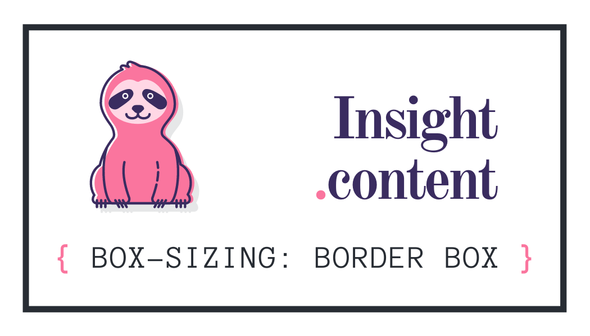

✅<a href="https://andreadcsousa.github.io/alura_webpage_grid/"> Veja a Página </a>✅<a href="https://github.com/andreadcsousa"> Meu Perfil </a>✅<a href="https://andreadcsousa.github.io/"> Projetos </a>

# Sobre o Curso/Projeto

A partir do minicurso `CSS Grid: Simplificando layouts`, aprendi a fazer a página da [Alura Store](https://cursos.alura.com.br/course/css-grid-layout).

- Simplifique a criação de layouts complexos;
- Posicione elementos com mais facilidade;
- Utilize grid para calcular e alinhar elementos;
- Crie templates com mais eficiência e simplicidade;
- Diga para os elementos onde eles devem se posicionar;
- Diga para os elementos onde eles devem começar e terminar.

# Linguagens Utilizadas

## Alura Store

Posicionando elementos GRID na página.

